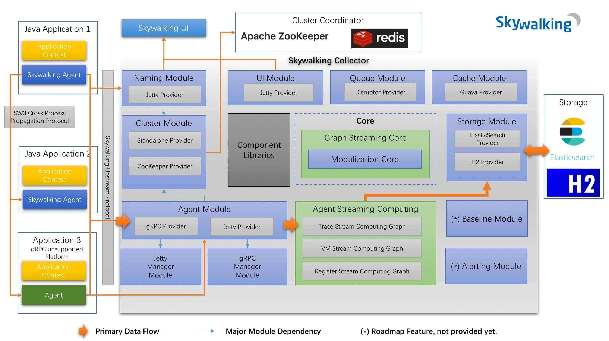
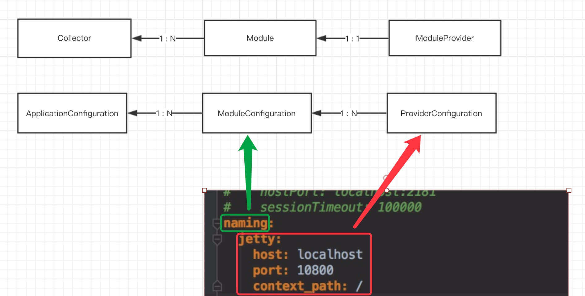
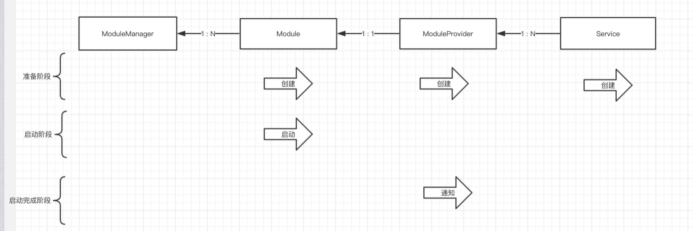
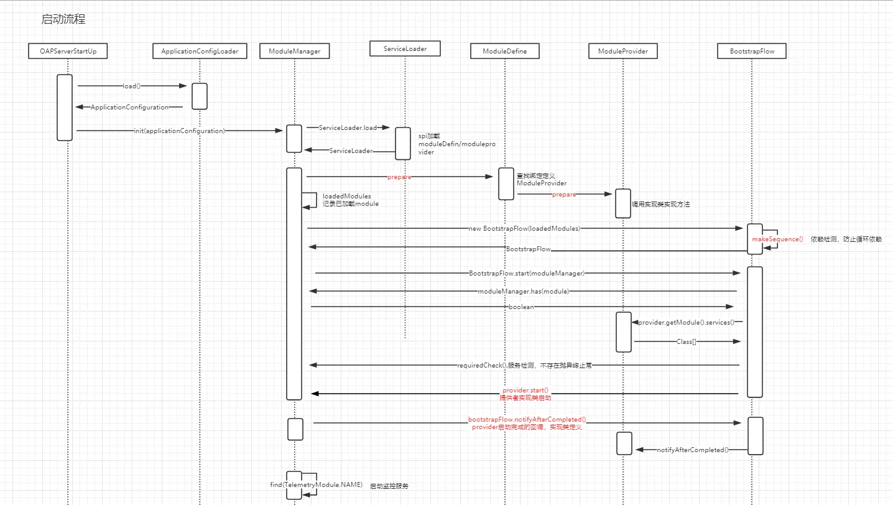

# Implementation

5.0 以前的module 整体组件模块依赖，以及规划的feature 如下

## Module 模型

### 模型关系图

拿Jetty模块举例

### 初始化过程图

## 启动流程
ModuleManger负责组件的管理和初始化：核心思想借助于java.utils.ServiceLoader机制， 同时，使用BootstrapFlow解决模块之间的依赖初始化关系，以及模块初始完成后的回调机制

## 参考
1. [Skywalking源码分析](https://www.jianshu.com/p/106ed5dc05b0)