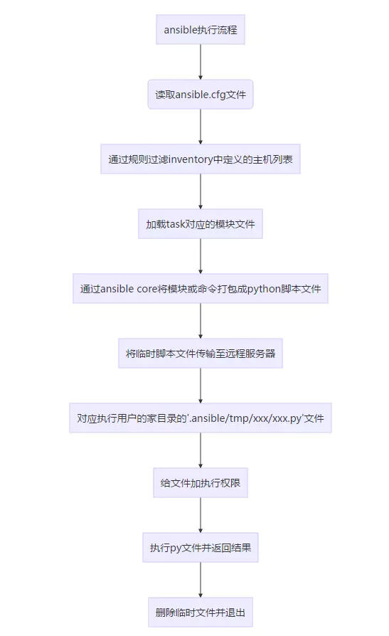

# Ansible 是什么？

ansible是一种自动化运维工具,基于paramiko开发的,并且基于模块化工作，Ansible是一种集成IT系统的配置管理、应用部署、执行特定任务的开源平台，它是基于python语言，由Paramiko和PyYAML两个关键模块构建。集合了众多运维工具的优点，实现了批量系统配置、批量程序部署、批量运行命令等功能.ansible是基于模块工作的,本身没有批量部署的能力.真正具有批量部署的是ansible所运行的模块，ansible只是提供一种框架.ansible不需要在远程主机上安装client/agents，因为它们是基于ssh来和远程主机通讯的.

ansible被定义为配置管理工具,配置管理工具通常具有以下功能:

* 确保所依赖的软件包已经被安装
* 配置文件包含正确的内容和正确的权限
* 相关服务被正确运行
# Ansible 和其她运维工具的比较
| 项目              | Puppet                                                | SaltStack                                | Ansible                                         |
|-----------------|-------------------------------------------------------|------------------------------------------|-------------------------------------------------|
| 开发语言            | Ruby                                                  | Python                                   | Python                                          |
| 是否有客户端          | 有                                                     | 有                                        | 无                                               |
| 是否支持二次开发        | 不支持                                                   | 支持                                       | 支持                                              |
| 服务器与远程机器是否相互验证  | 是                                                     | 是                                        | 是                                               |
| 服务器与远程机器的通信是否加密 | 是，标准的SSL协议                                            | 是，使用AES加密                                | 是，使用OpenSSH                                     |
| 平台支持            | AIX , BSD, HP\-UX, Linux , Mac OSX , Solaris, Windows | BSD, Linux , Mac OS X , Solaris, Windows | AIX , BSD , HP\-UX , Linux , Mac OS X , Solaris |
| 是否提供Web UI      | 提供                                                    | 提供                                       | 提供，但是是商业版本                                      |
| 配置文件格式          | Ruby 语法格式                                             | YAML                                     | YAML                                            |
| 命令行执行           | 不支持，大师可以通过配置模块实现                                      | 支持                                       | 支持                                              |
# Ansible 是什么样子的
## Ansible 有什么特点
部署简单, 只需要在控制主机上部署ansible环境,被控制端上只要求安装ssh和python 2.5以上版本,这个对于类unix系统来说相当与无需配置.

+ no angents: 被管控节点无需安装agent
+ no server: 无服务端,使用是直接调用命名
+ modules in any languages: 基于模块工作, 可以使用任意语言开发模块
+ 易读的语法: 基于yaml语法编写playbook
+ 基于推送模式: 不同于puppet的拉取模式,直接由调用者控制变更在服务器上发生的时间
+ 模块是幂等性的:定义的任务已存在则不会做任何事情,意味着在同一台服务器上多次执行同一个playbook是安全的
## 架构图


上图为ansible的基本架构，从上图可以了解到其由以下部分组成：

* **核心**：ansible
* **核心模块（Core Modules）**：这些都是ansible自带的模块
* **扩展模块（Custom Modules）**：如果核心模块不足以完成某种功能，可以添加扩展模块
* **插件（Plugins）**：完成模块功能的补充
* **剧本（Playbooks）**：ansible的任务配置文件，将多个任务定义在剧本中，由ansible自动执行
* **连接插件（Connectior Plugins）**：ansible基于连接插件连接到各个主机上，虽然ansible是使用ssh连接到各个主机的，但是它还支持其他的连接方法，所以需要有连接插件
* **主机群（Host Inventory）**：定义ansible管理的主机
## 原理图


以上是从网上找到的两张ansible工作原理图，两张图基本都是在架构图的基本上进行的拓展。从上面的图上可以了解到：

1、管理端支持local 、ssh、zeromq 三种方式连接被管理端，默认使用基于ssh的连接－－－这部分对应基本架构图中的连接模块；

2、可以按应用类型等方式进行Host Inventory（主机群）分类，管理节点通过各类模块实现相应的操作－－－单个模块，单条命令的批量执行，我们可以称之为ad-hoc；

3、管理节点可以通过playbooks 实现多个task的集合实现一类功能，如web服务的安装部署、数据库服务器的批量备份等。playbooks我们可以简单的理解为，系统通过组合多条ad-hoc操作的配置文件 。

## Ansbile 的结构
+ 配置文件: /etc/ansible/
+ 执行文件目录: /usr/bin/
+ lib依赖库: /usr/lib/python2.7/site-packages/ansible/
+ help文件: /usr/lib/python2.7/site-packages/ansible

## Ansible任务执行
### ansible任务执行模式
Ansible任务执行模式分为以下两种:

+ **ad-hoc模式(点对点模块)**
使用单个模块,支持批量执行单条命令,相当与在bash中执行一句shell命令
+ **playbook模式(剧本模式)**
ansible主要的管理方式,通过多个task的集合完成一类功能,可以理解为多个ad-hoc的配置文件

### ansible执行流程


# Ansible的安装
## 源代码安装
忽略
## rpm包安装
忽略
# 配置文件
## ansible配置文件查找顺序
* 检查环境变量ANSIBLE_CONFIG指向的路径文件(export ANSIBLE_CONFIG=/etc/ansible.cfg)；
* ~/.ansible.cfg，检查当前目录下的ansible.cfg配置文件；
* /etc/ansible.cfg检查etc目录的配置文件。
## ansible配置文件
常用参数
``` properties
    inventory = /etc/ansible/hosts      #这个参数表示资源清单inventory文件的位置
    library = /usr/share/ansible        #指向存放Ansible模块的目录，支持多个目录方式，只要用冒号（：）隔开就可以
    forks = 5       #并发连接数，默认为5
    sudo_user = root        #设置默认执行命令的用户
    remote_port = 22        #指定连接被管节点的管理端口，默认为22端口，建议修改，能够更加安全
    host_key_checking = False       #设置是否检查SSH主机的密钥，值为True/False。关闭后第一次连接不会提示配置实例
    timeout = 60        #设置SSH连接的超时时间，单位为秒
    log_path = /var/log/ansible.log     #指定一个存储ansible日志的文件（默认不记录日志）

```
# Inventory
nsible的主要功用在于批量主机操作，为了便捷地使用其中的部分主机，可以在inventory file中将其分组命名。默认的inventory file为/etc/ansible/hosts。
inventory file可以有多个，且也可以通过Dynamic Inventory来动态生成。
## 文件格式
* inventory文件遵循INI文件风格，中括号中的字符为组名。可以将同一个主机同时归并到多个不同的组中；此外，当如若目标主机使用了非默认的SSH端口，还可以在主机名称之后使用冒号加端口号来标明。
```ini
ntp.com

[webservers]
www1.com:2222
www2.com

[dbservers]
db1.com
db2.com
db3.com
```
* 如果名字类似，可以采用列表的方式
```ini
[webservers]
www[01:50].example.com

[databases]
db-[a:f].example.com
```
* 主机变量: 可以在inventory中定义主机时为其添加主机变量以便于在playbook中使用。例如：
```ini
[webservers]
www1.com http_port=80 maxRequestsPerChild=808
www2.com http_port=8080 maxRequestsPerChild=909
```
* 组变量
```
[webservers]
www1.com
www2.com

[webservers:vars]
ntp_server=ntp.com
nfs_server=nfs.com
```
## 其他参数
ansible基于ssh连接inventory中指定的远程主机时，还可以通过参数指定其交互方式；这些参数如下所示：
```
ansible_ssh_host # 远程主机
ansible_ssh_port # 指定远程主机ssh端口
ansible_ssh_user # ssh连接远程主机的用户,默认root
ansible_ssh_pass # 连接远程主机使用的密码,在文件中明文,建议使用--ask-pass或者使用SSH keys
ansible_sudo_pass # sudo密码, 建议使用--ask-sudo-pass
ansible_connection # 指定连接类型: local, ssh, paramiko
ansible_ssh_private_key_file # ssh 连接使用的私钥
ansible_shell_type # 指定连接对端的shell类型, 默认sh,支持csh,fish
ansible_python_interpreter # 指定对端使用的python编译器的路径
```

# 运行
## ad-hoc 模式运行
ansible通过ssh实现配置管理、应用部署、任务执行等功能，因此，需要事先配置ansible端能基于密钥认证的方式联系各被管理节点。

ansible命令使用语法:
```bash
ansible <host-pattern> [-f forks] [-m module_name] [-a args]
    -m module：默认为command

```
例如
* 定义好inventory后可以调用ping模块来检测网络是否可达
``` shell
# ansible all -m ping
192.168.57.22 | SUCCESS => {
    "changed": false, 
    "ping": "pong"
}
192.168.57.11 | SUCCESS => {
    "changed": false, 
    "ping": "pong"
}
```
