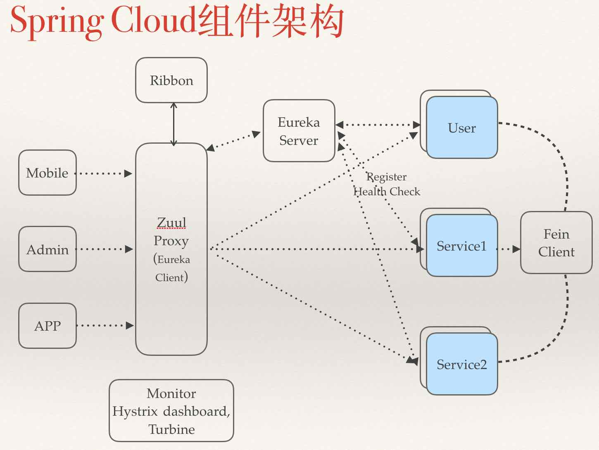
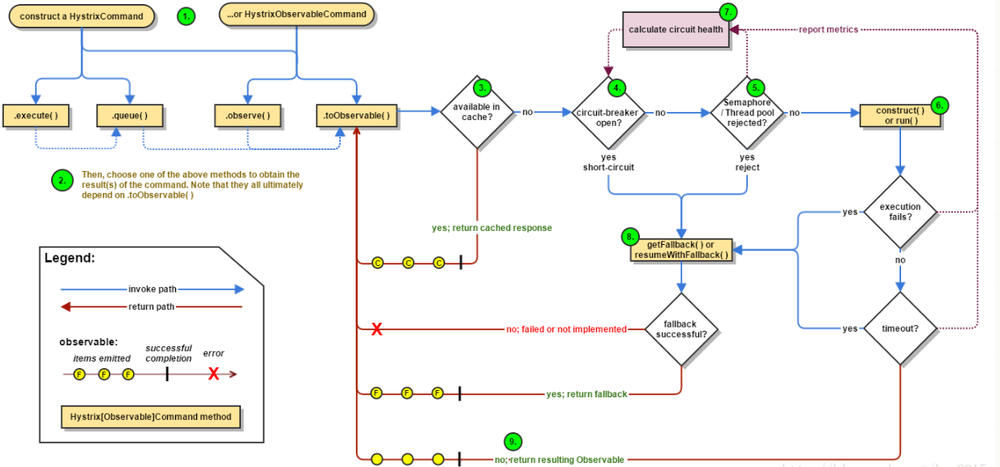

# Spring Cloud

## 组件图
Spring Cloud原生是使用的Spring Eureka来实现服务注册， Zuul来实现服务网关。 Fein Client提供Http的服务访问。 Hystrix提供服务简单的故障熔断等

## 熔断和限流
### Hystrixl

## Reference
1. [SpringCloud实战3-Hystrix请求熔断与服务降级](https://www.cnblogs.com/huangjuncong/p/9026949.html)
2. []
