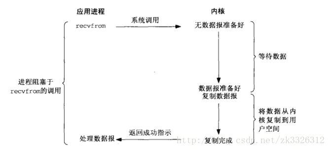
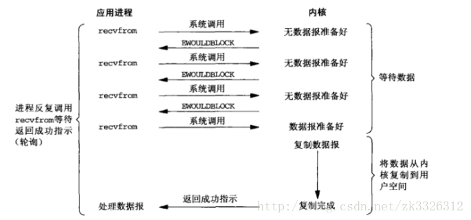

# IO模型
## 什么是IO
 计算机设备包括Input/Output设备，我们从这些设备读取或者向这些设备写入数据。就是泛指的IO操作。IO在编程模型上，抽象为字节流。具体实现，就是大家周知的Socket套接字
 
  现在操作系统的一次IO操作，涉及到两个过程 1.数据准备阶段，2.内核空间复制回用户进程缓冲区空间
  
  IO操作从用户申请数据到得到数据，中间需不需要阻塞等待，可以将IO分为阻塞IO和异步IO。
## 同步IO和异步IO
```
POSIX(可移植操作系统接口)把同步IO操作定义为导致进程阻塞直到IO完成的操作，反之则是异步IO
```
## 阻塞IO和非阻塞IO 
我们所言的阻塞IO和非阻塞IO都属于同步IO， 拿Linux的IO操作（open(),close(),read(),write(),send(),recv(),lseek()) recv() 来讲解IO模型，recv（）它用于从套接字上接收一个消息。
### 阻塞IO模型
如图：

正如阻塞语意所言，当发起recv()操作，作为一个linux系统调用，首先会从用户进程空间切换到内核空间，运行一段时间，在切换回来，默认，即阻塞模型等待从设备接受完成所有数据，然后将数据从内核空间Copy到用户空间，才返回。而在这个过程中，用户的线程无法做其他事情。

很明显，如果在等待数据准备就绪的过程中，线程可以做其他事情，那么效率更高，所以非阻塞IO模型出现了。
### 非阻塞IO模型
如图: 

Linux操作系统可以通过fcntl（POSIX）或ioctl（Unix）设为非阻塞模式。 这时候再调用recv(), 就直接返回，不管信息有没有读取到。

好处很明显，recv()了之后进程马上能处理下一行代码，坏处也很明显，就是你不知道你的消息是否读完了，这种问题就是TCP中大名鼎鼎的半包问题，而且为了能够保证数据的完整性，还需要做不断的轮训以及校验。

阻塞IO和非阻塞IO的区别在于，在数据准备阶段，是否可以做其他的事情。与之对应的异步IO，就是，在数据准备阶段，和内核空间复制回用户进程缓冲区空间阶段，都可以做其他事情。

## 阻塞IO详解
 参考[Socket](socket.md)
 
## 非阻塞IO详解
### IO复用模型
如图: 
### 信号量模型
如图: 
## 异步IO
如图: 
## 模型比较
如图: 


# 参考
TCP协议的粘包和半包问题

