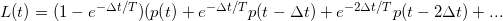
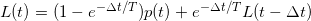
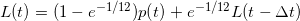

## 引子

有没有遇到过：

1. 刚上线的应用，还没有引流量，好不容易接入监控，却时不时的来n多条CPU load过高的报警？

2. 一头雾水的你，翻看各种日志，执行各种命令，却抓不到任何消息？


好了，不打哑谜，我们来一步一步揭秘？


## 定义

[Wikipedia](https://en.wikipedia.org/wiki/Load_(computing))的定义：
> In UNIX computing, **the system load** is a measure of the amount of computational work that a computer system performs. The load average represents the average system load over a period of time. It conventionally appears in the form of three numbers which represent the system load during the last one-, five-, and fifteen-minute periods.

[Linux Kernel: loadavg.c](https://github.com/torvalds/linux/blob/master/kernel/sched/loadavg.c):
> The global load average is an exponentially decaying average of nr_running + nr_uninterruptible.

[Linux Manual](https://linux.die.net/man/5/proc) 关于 **/proc/loadavg**的定义
> The first three fields in this file are load average figures giving the number of jobs in the run queue (state R) or waiting for disk I/O (state D) averaged over 1, 5, and 15 minutes. They are the same as the load average numbers given by uptime(1) and other programs. The fourth field consists of two numbers separated by a slash (/). The first of these is the number of currently runnable kernel scheduling entities (processes, threads). The value after the slash is the number of kernel scheduling entities that currently exist on the system. The fifth field is the PID of the process that was most recently created on the system.


对于linux而言： run queue  waiting for disk I/O 是影响load 的因素

## 获取loadavg的方式

- cat /prod/loadavg: 解释参考
  
    ```bash
    [root@fs03-192-168-xx-xx ~]# cat /proc/loadavg
    3.87 4.57 4.48 4/1067 10360
    ```

- uptime

    ```bash
    [root@fs03-192-168-xx-xx proc]# uptime
    14:05:40 up 36 days, 28 min,  1 user,  load average: 3.14, 3.47, 3.98
    ```

- top
  
  ```bash
    top - 14:07:06 up 36 days, 29 min,  1 user,  load average: 3.55, 3.49, 3.93
    Tasks: 178 total,   4 running, 174 sleeping,   0 stopped,   0 zombie
    %Cpu(s): 51.4 us,  0.7 sy,  0.0 ni, 47.7 id,  0.1 wa,  0.0 hi,  0.1 si,  0.0 st
    KiB Mem : 32540444 total,   406492 free, 15126132 used, 17007820 buff/cache
    KiB Swap:        0 total,        0 free,        0 used. 15547664 avail Mem

    PID USER      PR  NI    VIRT    RES    SHR S  %CPU %MEM     TIME+ COMMAND
    25369 root      20   0    4400    616    404 R 100.0  0.0  33332:58 make
    26822 root      20   0    4400    620    408 R 100.0  0.0  33310:36 make
    6859 root      20   0    4400    956    748 R  99.7  0.0   4345:44 make
  ```

- w
  
  ```bash
    [root@fs03-192-168-xx-xx proc]# w
    14:07:50 up 36 days, 30 min,  1 user,  load average: 3.48, 3.49, 3.92
    USER     TTY      FROM             LOGIN@   IDLE   JCPU   PCPU WHAT
    root     pts/0    192.168.217.1    13:56    6.00s  0.05s  0.00s w
  ```

## loadavg 如何计算

### Exponentially Decaying Average 

参考[Moving Average](https://zh.wikipedia.org/wiki/%E7%A7%BB%E5%8B%95%E5%B9%B3%E5%9D%87)，指数平均比其他平均值，更能体现真实的情况
加入我们把nr_active在某一时刻的数量叫做p(t)，我们计算loadavg的时间段是T，采样室 &Delta;t;那么计算公式如下






### 计算公式

在每次采样的时候, 核心计算简化逻辑如下

```
    nr_active = 0;
    for_each_possible_cpu(cpu)
 	nr_active += cpu_of(cpu)->nr_running + cpu_of(cpu)->nr_uninterruptible;

    avenrun[n] = avenrun[0] * exp_n + nr_active * (1 - exp_n)
```

相关源代码：

```c
/*
 * calc_load - update the avenrun load estimates 10 ticks after the
 * CPUs have updated calc_load_tasks.
 *
 * Called from the global timer code.
 */
void calc_global_load(unsigned long ticks)
{
	unsigned long sample_window;
	long active, delta;

	sample_window = READ_ONCE(calc_load_update);
	if (time_before(jiffies, sample_window + 10))
		return;

	/*
	 * Fold the 'old' NO_HZ-delta to include all NO_HZ CPUs.
	 */
	delta = calc_load_nohz_fold();
	if (delta)
		atomic_long_add(delta, &calc_load_tasks);

	active = atomic_long_read(&calc_load_tasks);
	active = active > 0 ? active * FIXED_1 : 0;

	avenrun[0] = calc_load(avenrun[0], EXP_1, active);
	avenrun[1] = calc_load(avenrun[1], EXP_5, active);
	avenrun[2] = calc_load(avenrun[2], EXP_15, active);

	WRITE_ONCE(calc_load_update, sample_window + LOAD_FREQ);

	/*
	 * In case we went to NO_HZ for multiple LOAD_FREQ intervals
	 * catch up in bulk.
	 */
	calc_global_nohz();
}

```

其中 avenrun存储了 loadavg的值。 周期性通过比较 jiffies（linux kernel代表时间的变量，每一个tick + 1） 和sample_widnows + 10来实现, 换句话说，loadavg，每LOAD_FREG(5*HZ[<sup>1</sup>](#references)+1),更新一次这个值

```c
/*
 * a1 = a0 * e + a * (1 - e)
 */
static unsigned long
calc_load(unsigned long load, unsigned long exp, unsigned long active)
{
    unsigned long newload;

    newload = load * exp + active * (FIXED_1 - exp);
    if (active >= load)
        newload += FIXED_1-1;

    return newload / FIXED_1;
}
```

总结一下：

``` bash
 avenrun[0] = ((FIXED_1 - EXP_1) * active + EXP_1 * avenrun[0]) / FIXED_1;
```
根据 linux内核[include/linux/sched/loadavg.h](https://github.com/torvalds/linux/blob/master/include/linux/sched/loadavg.h) 定义```EXP_1=1884```而```FIXED_1=1<<11```, 通过替换 &Delta;t=5, t=60后得到的公式为


      
**Linux**内核为了加速计算，采用shift 11位来计算，也就是  的近似计算值为1884。 
　

## References

1.  HZ: the value of how many ticks increase per second, It refers to the kernel timer frequency CONFIG_HZ, which must be distinguished from the userland frequency USER_HZ. USER_HZ is the value obtained from getconf CLK_TCK and /proc/stat, which is defined as 100 on x86. The kernel timer frequency can be checked with 
   
    ``` bash 
    grep "CONFIG_HZ=" /boot/config-$(uname -r) 
    # or by watching the increment
    watch -n1 "grep ^jiffies /proc/timer_list | head -n1"
    ```
