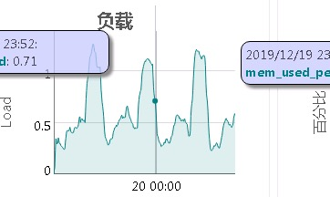
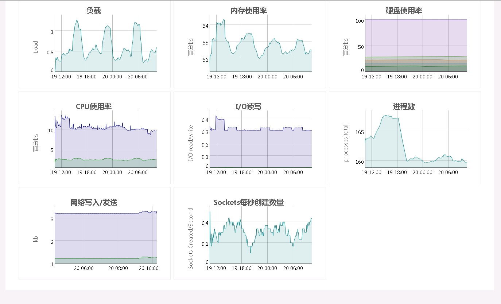

# 记Linux CPU Load过高问题跟踪

最近每天都会有cpu负载过高的短信报警搅扰大家的清梦。所以特地追踪分析一下，定位解决问题。

## 现象

### 系统环境

|环境|版本|备注|
|---|---|---
|操作系统| centos 7| |
|运行服务|telegraf, influxdb, 系统巡检程序| |
|系统配置|CPU 2核，内存8G，硬盘512| |

### 系统服务报警图

负载图如下：



整体系统的监控图如下：



以上两个图都平均值

现象奇怪的CPU，硬盘，内存IO，进程数，网络并没有像负载那样有规律的有尖峰起伏，需要深入系统中，进行分析

## 理解CPU load

参考[loadavg](loadavg.md)

## 分析

### 系统分析

### 参考文献

### 解决办法


## 解决办法

1. 减少同时运行的线程数

telegraf 具体的配置在/etc/telegraf/telegraf.conf。关于agent的配置如下

``` ini
[agent]
  interval = "10s"
  round_interval = true
  metric_batch_size = 1000
  metric_buffer_limit = 10000
  collection_jitter = "0s"
  flush_interval = "10s"
  flush_jitter = "0s"
  precision = ""
  debug = false
  quiet = false
  hostname = ""
  omit_hostname = false
```

把其中的 collection_jitter 修改为3s 这个参数，控制telegraf的线程启动的时候会随机sleep小于3s的值。这样基本可以控制同时运行的线程数

2. 升级CPU的核数，或者将telegraf的程序关于influxdb的现场抽离。

## 参考

[时间序列模型-移动平均数](https://blog.csdn.net/qq_29831163/article/details/89440215)