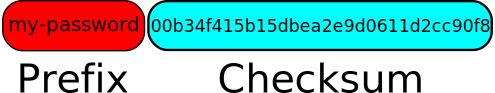

# 怎么保护你的密码
现在的密码学是基于秘钥的安全来完成的，那么密码本身的安全，密码的存储安全，密码使用途径和环境的安全是至关重要的。
## 密码本身的安全
1、密码强度不够

## 密码存储的安全
借助于外借存储，比如日记，电脑，或者专用芯片或者存储在云密码管理器，我们总是感觉为密码管理专门搭建Valut系统，那么Vault本身的安全性又是个问题，此外，对我们个人而言也是很不安全的， 从目前的技术而言， 密码存储在我们的脑子中是最安全的（除非能读取记忆），当然威逼利诱，那是另一回事了，但是我们的记忆水平有线，系统繁多，如果都用同一个密码显然是不安全的，如果我们使用不同的密码，我们又不可能记住所有的密码。所以我们需要结合密码本身的安全和我们的记忆，使用一些更加便利的手段。
## 密码使用途径和环境的安全
密码使用的人，密码传递途径，密码使用的环境

在很多账户中管理不同的密码通常是困难的: 复杂的密码，包括手工制作的和由随机密码生成器生成的密码，很难记住，但是简单的密码通常不安全。 像 LastPass 这样的云密码管理器也不是一个安全的选择: 云密码管理器经常会遇到各种安全问题。 除此之外，把你的密码暴露给云密码管理公司也不是什么好事。 

## 生成算法
### 1. 使用固定密码+校验和
  校验和参考附录[1]，一般都是通过单向函数来完成。单向函数最大的优势就是较小字母的变动，会导致很大不同的结果

在这里，管理密码的基本策略是让每个帐户的密码都遵循“前缀 + 校验和”方案。 所有账户的前缀都是相同的，与通常的密码类似，例如，它可以是你当前的一个密码ーー这是你需要记住的密码。 校验和部分对于每个帐户都是唯一的: 它可以是与主机相关的东西的 md5 / sha-1 / SHA-2校验和的一部分，例如网站的域名，或主机帐户的公司名称等。 这样，只需要记住一个全局前缀就可以轻松管理，而且每个账户的校验和部分都是唯一的，这带来了安全性。 例如，如下图所示，对于您在 quitter.se 的帐户，您可以使用字符串“ quitter.se”的 MD5校验和，它是00b34f415b15dbea2e9d0611d2cc90f8。 然后，使用如 my-password 这样的前缀，遵循“ prefix + checksum”方案，quitter.se 的密码将是 my-password00b34f415b15dbea2e9d0611d2cc90f8。 如果只使用校验和的一部分，例如校验和的前10个字符，那么密码就是 my-password00b34f415b。

### 2. 借助于诗词等便于记忆的东西，进行规则转换。
比较经典的例子如
- 通过经典的斐波那契数列转换 电影**达芬奇密码**中曾使用，当然可以扩展到其他的数列中
- 经典的笑话，饭店的wifi密码: lyb82ndlf (来一杯82年的拉菲）

类似的可参考[黄老邪使用古诗词创建好记的密码 #22](https://github.com/bingoohuang/blog/issues/22)

## 参考
1. [1]: 校验和是小型字符串，可以通过特定的校验和算法从其他字符串中计算出来。 使用最流行的校验和算法，例如 MD5、 SHA-1等，校验和通常看起来与原始字符串非常不同，甚至改变原始字符串的一个比特通常导致非常不同的校验和。 例如，两个相似的单词“ bird”和“ birds”的 MD5校验和是完全不同的(你可以使用本网站计算一个字符串的校验和，或者使用 gnu / linux 或 Max OS x 的 md5sum 或 sha1sum 命令行工具) :

STRING|MD5 CHECKSUM
-------|-------------
bird |87d28160e9215b17645c734ba7170ba1
birds| ea5f5a5293a7d404e091c04939ba2ad8
2. [Manage Passwords for Multiple Accounts with Checksums](https://www.topbug.net/blog/2016/04/30/manage-passwords-for-multiple-accounts-with-checksums/)
